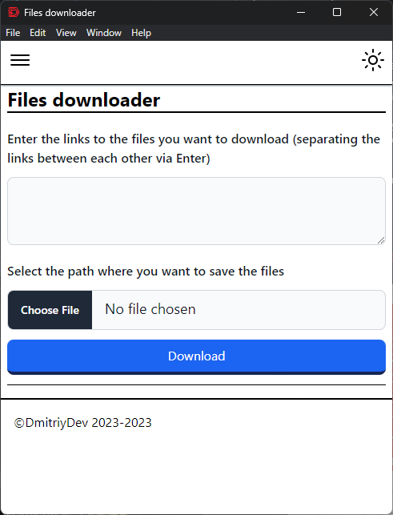
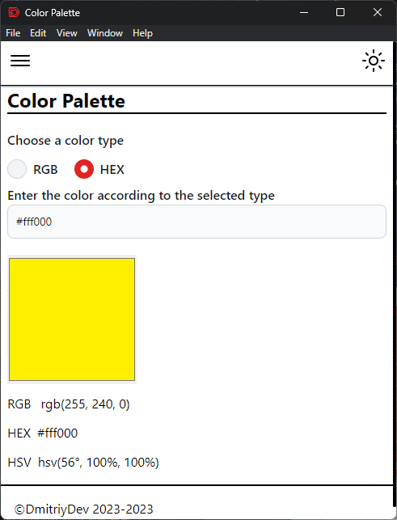

# All In One Toolkit

This is a project on [Electron](https://www.electronjs.org). On this framework, you can develop desktop applications using web technologies. In this project, pages are being developed that solve some problems from the IT sphere. There are some that automate the work a little or speed up the process of cyclical actions.

## Screenshots

### Home page


### Count words


### Virus Total


### Url Encoder/Decoder


### Base64 Encoder/Decoder


### Document to txt file


### Visualization data on chart


### Text to Speech


### File downloader


### Color Palette


### XLSX to JSON


### Visualization of data in CSV format in tabular form


### Visualization of data in JSON format in tabular form


### Weather


## Installation

First you need to install all the dependencies to run this project. But first make sure you have Node js installed.
To do this, open a command prompt or terminal and type the following commands:

```bash
node -v
```

```bash
npm -v
```

If you are using the pnpm package manager, then run this command:

```bash
pnpm -v
```

After that, go to the folder with this project and run the following command:

```bash
npm install
```

If you are using the pnpm package manager, then run this command:

```bash
pnpm install
```

## Usage

After installing the dependencies, use the following command to run, depending on the package manager you are using:

```bash
npm run start
```
Or
```bash
pnpm start
```

## Authors

- [Dmitriy303](https://github.com/rusnakdima)

## License

This project is licensed under the [License Name](LICENSE.MD).

## Contact

If you have any questions or comments about this project, please feel free to contact us at [contact email](rusnakdima03@gmail.com).